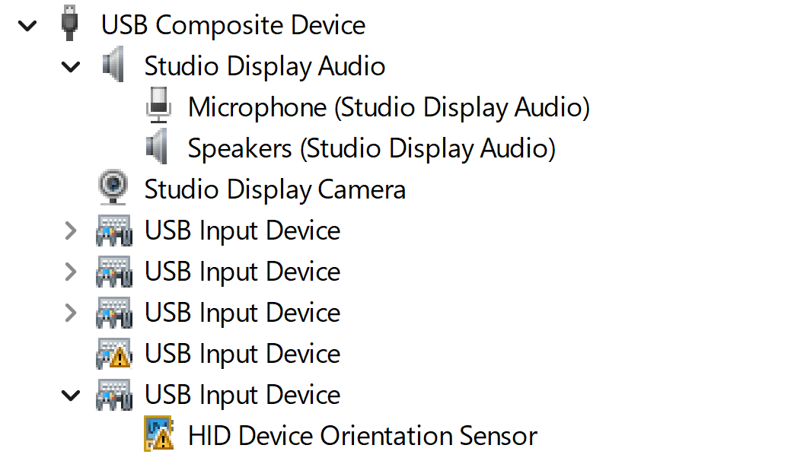
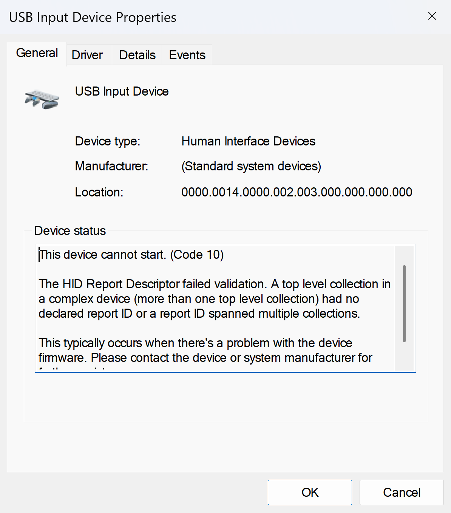
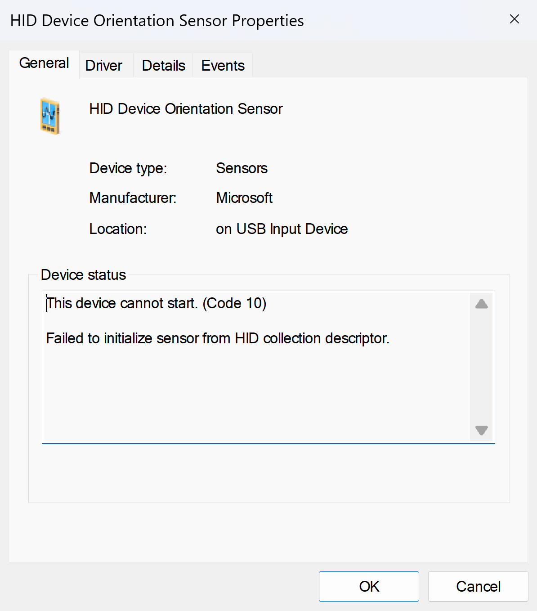
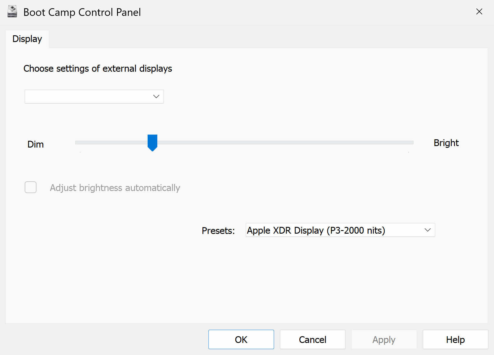
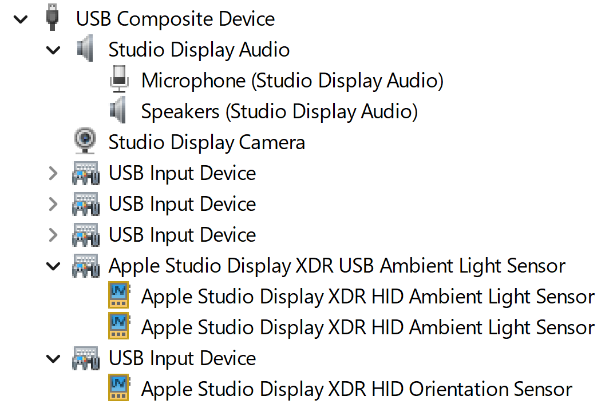
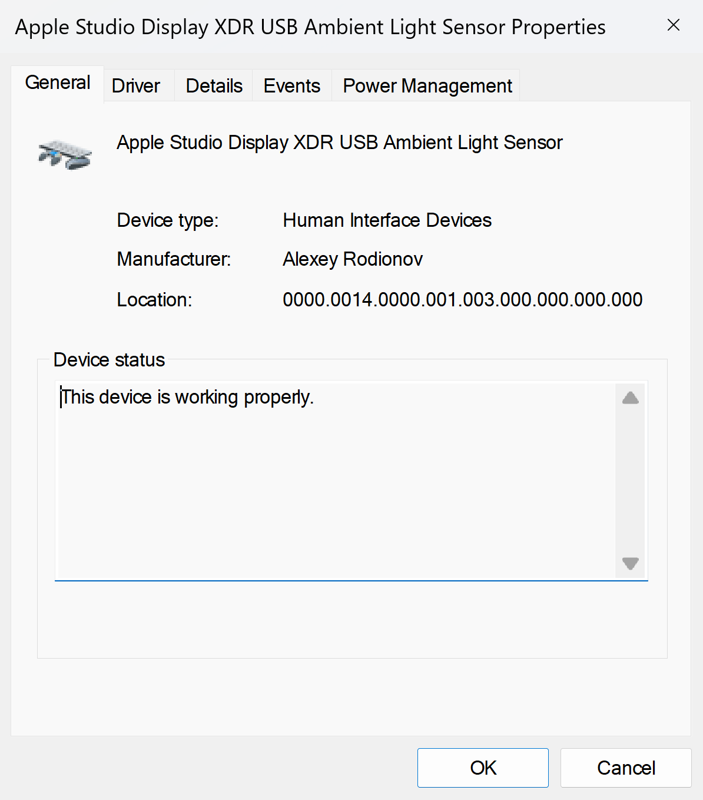
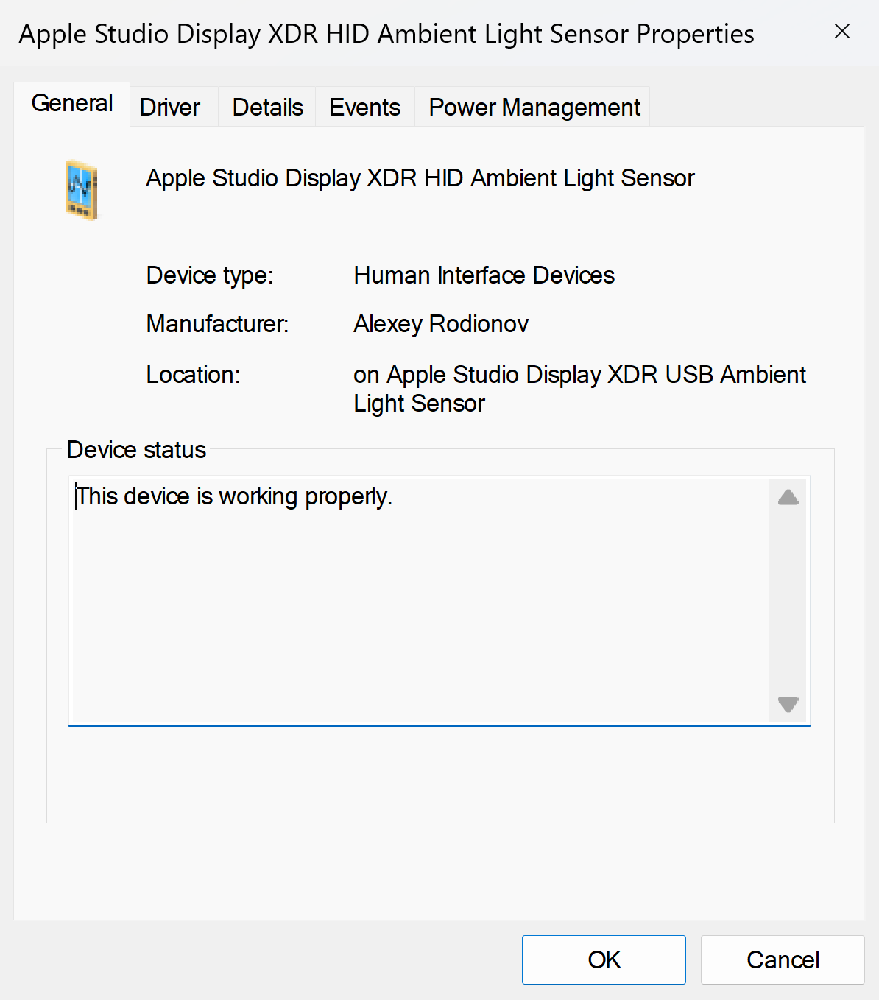
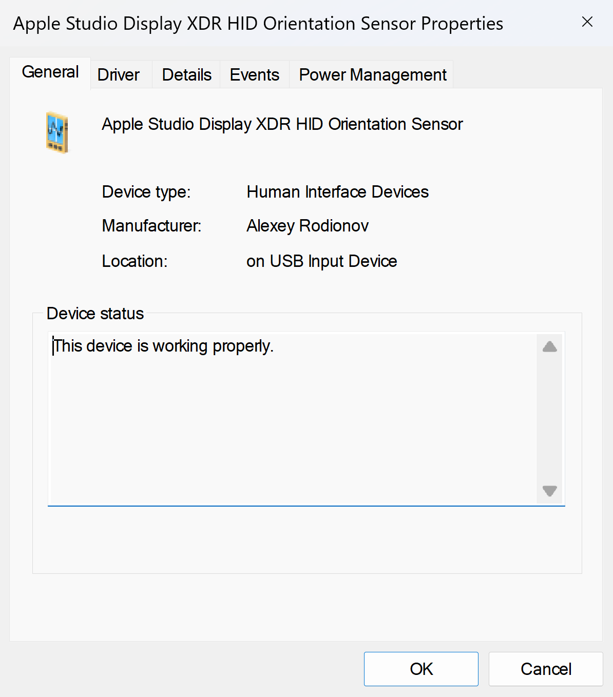
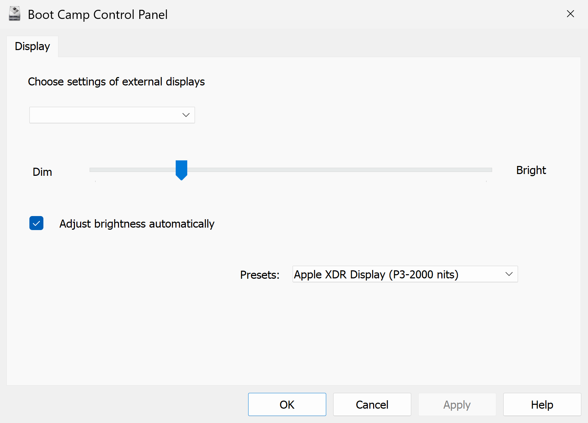

# Apple Studio Display XDR (2026) Sensors Fix Windows Driver

## What is it?

This is an unofficial Windows driver that fixes the Apple Display HID Orientation Sensor and Apple Display HID Ambient Light Sensor on the Apple Studio Display XDR (2026) (`VID_05AC&PID_1116`) to work with the Apple Boot Camp Control Panel and third-party apps such as [StudioBrightness++](https://github.com/LitteRabbit-37/Studio-Brightness-PlusPlus).

The orientation sensor is required for automatic display rotation when the monitor is physically rotated.

The ambient light sensor is required for automatic display brightness adjustment based on ambient light levels.

Apple Studio Display (2026) (`VID_05AC&PID_1118`) is not currently supported by this driver.

For Apple Pro Display XDR (2019) (`VID_05AC&PID_9243`), Apple Studio Display (2022) (`VID_05AC&PID_1114`), and LG UltraFine (`VID_043E&PID_9A40`, `VID_043E&PID_9A63`, `VID_043E&PID_9A70`), see the official [Apple Studio Display Sensors Windows Driver](https://github.com/FluorescentHallucinogen/apple-studio-display-sensors-windows-driver).

This is not an Apple product and is not affiliated with or endorsed by Apple.

## What's the problem?

Apple provides Windows support for its displays as part of Apple Boot Camp Support Software. It includes the Boot Camp Control Panel and a [null driver](https://github.com/FluorescentHallucinogen/apple-studio-display-sensors-windows-driver) for the sensor interfaces.

The last Apple Boot Camp Support Software update was released in 2022.

So it doesn't support anything released after that.

Boot Camp exists because Intel Macs could boot Windows natively. With Apple's transition to Apple Silicon, Windows no longer runs natively on Apple Silicon Macs. Boot Camp as a product has no future. Apple has no remaining product reason to touch Boot Camp Support Software at all. After more than four years without an update, the probability that Apple will ship a Boot Camp update adding support for the Apple Studio Display (2026) (`VID_05AC&PID_1118`) and Apple Studio Display XDR (2026) (`VID_05AC&PID_1116`) is, realistically, close to zero.

When an Apple Studio Display XDR (2026) (`VID_05AC&PID_1116`) is connected to a Windows PC using a Thunderbolt/USB-C to Thunderbolt/USB-C cable or a DisplayPort + USB to USB-C cable, the display works via DisplayPort Alt Mode, the built-in USB hub, camera, speakers, and microphone are detected as standard USB devices and work out of the box.

The sensors do not.

They show up in Device Manager with a yellow warning triangle and fail with "Code 10" for two different reasons:

This driver fixes that:

## How to install?

1. Disable Secure Boot in UEFI settings.
2. Download and extract the latest successful build artifact from the [Actions](https://github.com/FluorescentHallucinogen/apple-studio-display-xdr-sensors-fix-windows-driver/actions) tab.
3. Run as administrator the `install.bat`.
4. Reboot the system.

## How does it work?

The driver consists of two parts.

The USB Ambient Light Sensor (`USB\VID_05AC&PID_1116&MI_08`) interface descriptor declares two top-level collections: one (`05 20 09 41 A1 01 85 01 …`) with a Report ID, and the other (`06 00 FF 09 1A A1 01 C0 …`) without a Report ID.

Windows refuses descriptors that mix top-level collections with and without Report IDs.

The first driver (`AppleStudioDisplayXDRAmbientLightUSBSensorFix`) is a fix driver.

It rewrites the `06 00 FF 09 1A A1 01 C0` bytes on the fly, in place, to `06 00 FF 06 00 FF 05 20`.

The patch only applies on an exact 8-byte match, so an unexpected or updated firmware descriptor is left untouched rather than corrupted.

Without this, the two (front and rear) HID Ambient Light Sensors (`HID\VID_05AC&PID_1116&MI_08&Col01` and `HID\VID_05AC&PID_1116&MI_08&Col02`) will not be detected.

The second driver (`AppleStudioDisplayXDRAmbientLightOrientationHIDSensorsNull`) is a null driver.

It matches the HID Ambient Light Sensors (`HID\VID_05AC&PID_1116&MI_08&Col01`, `HID\VID_05AC&PID_1116&MI_08&Col02`) and HID Orientation Sensor (`HID\VID_05AC&PID_1116&MI_09`) interfaces, assigns them friendly names, and installs no service, allowing apps to read raw HID data.

## What next?

- [ ] Add support for the Apple Studio Display (2026) (`VID_05AC&PID_1118`).
- [ ] Get a Microsoft-trusted certificate to sign the driver so it can be installed without disabling Secure Boot in the UEFI settings, enabling Test Mode in Windows, or adding the self-signed test certificate to the Windows trusted certificate stores.
- [ ] Report the issue to Apple so it can release a firmware update for the Apple Studio Display XDR (2026) (`VID_05AC&PID_1116`) that fixes the `USB\VID_05AC&PID_1116&MI_08` descriptor for Windows.
